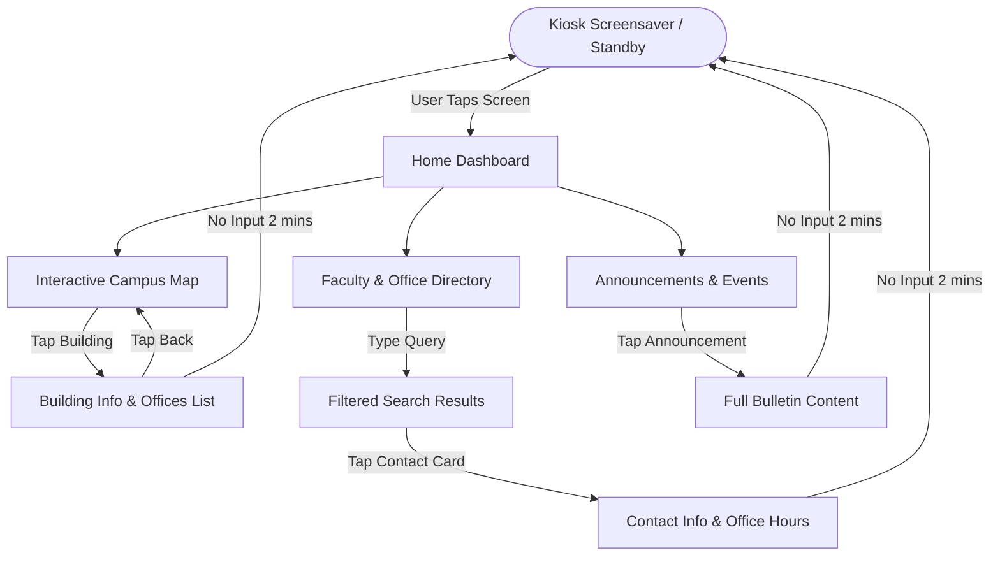

# User Journey & Flow Diagram

The following diagram illustrates how users navigate the kiosk interface.

```mermaid
graph TD
    Start([Kiosk Screensaver / Standby]) -->|User Taps Screen| Home[Home Dashboard]
    
    Home --> NavMap[Interactive Campus Map]
    Home --> NavDir[Faculty & Office Directory]
    Home --> NavNews[Announcements & Events]
    
    NavMap -->|Tap Building| BldgDetails[Building Info & Offices List]
    BldgDetails -->|Tap Back| NavMap
    
    NavDir -->|Type Query| FilterList[Filtered Search Results]
    FilterList -->|Tap Contact Card| DetailedCard[Contact Info & Office Hours]
    
    NavNews -->|Tap Announcement| ReadArticle[Full Bulletin Content]
    
    BldgDetails -->|No Input 2 mins| Start
    DetailedCard -->|No Input 2 mins| Start
    ReadArticle -->|No Input 2 mins| Start
```
